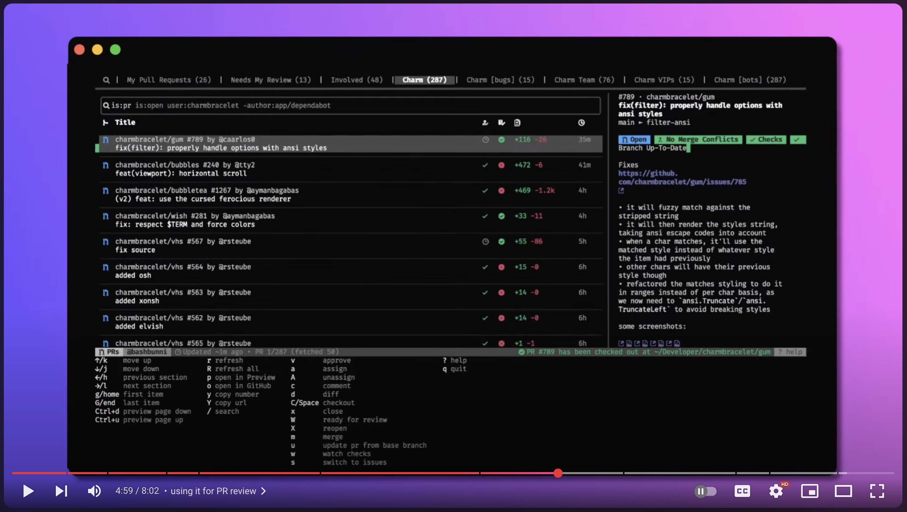

# gh-dash

✨ A GitHub (`gh`) CLI extension to display a dashboard with **pull requests** and **issues** by filters you care about.

<a href="https://github.com/charmbracelet/bubbletea/releases"></a>


## 📃 Docs

See the docs site at [dlvhdr.github.io/gh-dash](https://dlvhdr.github.io/gh-dash) to get started.

## ❓ Why use gh-dash

Check out this 10/10 video by [charm.sh ✨](https://charm.sh) explaining how gh-dash can help you manage your GitHub experience.

[](https://www.youtube.com/watch?v=5omFxcNjBQk&t "Manage open source like a boss (in the terminal)")

## ✨ Features

- 🌅 fully configurable - define sections using GitHub filters
- 🔍 search for both prs and issues
- 📝 customize columns with `hidden`, `width` and `grow` props
- ⚡️ act on prs and issues with checkout, comment, open, merge, diff, etc...
- ⌨️ set custom actions with new keybindings
- 💅 use custom themes
- 🔭 view details about a pr/issue with a detailed sidebar
- 🪟 write multiple configuration files to easily switch between completely different dashboards
- ♻️ set an interval for auto refreshing the dashboard

## 📦 Installation

1. Install the `gh` CLI - see the [installation](https://github.com/cli/cli#installation)

   _Installation requires a minimum version (2.0.0) of the GitHub CLI that supports extensions._

2. Install this extension:

   ```sh
   gh extension install dlvhdr/gh-dash
   ```

3. To get the icons to render properly you should download and install a Nerd font from https://www.nerdfonts.com/.
   Then, select that font as your font for the terminal.

<details>
   <summary>Installing Manually</summary>

> If you want to install this extension **manually**, follow these steps:

1. Clone the repo

   ```shell
   # git
   git clone https://github.com/dlvhdr/gh-dash
   ```

   ```shell
   # GitHub CLI
   gh repo clone dlvhdr/gh-dash
   ```

2. Cd into it

   ```bash
   cd gh-dash
   ```

3. Build it

   ```bash
   go build
   ```

4. Install it locally
   ```bash
   gh extension install .
   ```
   </details>

<details>
    <summary>Updating from an older version</summary>

```bash
gh extension upgrade dlvhdr/gh-dash
```

</details>

<details>
   <summary>How do I get these exact colors and font?</summary>

> I'm using [Alacritty](https://github.com/alacritty/alacritty) with the [tokyonight theme](https://github.com/folke/tokyonight.nvim) and the [Fira Code](https://github.com/ryanoasis/nerd-fonts/tree/master/patched-fonts/FiraCode) Nerd Font.
> For my full setup check out [my dotfiles](https://github.com/dlvhdr/dotfiles/blob/main/.config/alacritty/alacritty.yml).

</details>

## ⚡️ Usage

Run

```sh
gh dash
```

Then press <kbd>?</kbd> for help.

Run `gh dash --help` for more info:

```
Usage:
  gh dash [flags]

Flags:
  -c, --config string   use this configuration file
                        (default lookup:
                          1. a .gh-dash.yml file if inside a git repo
                          2. $GH_DASH_CONFIG env var
                          3. $XDG_CONFIG_HOME/gh-dash/config.yml
                        )
      --debug           passing this flag will allow writing debug output to debug.log
  -h, --help            help for gh-dash
```

## ⚙️ Configuring

You can find all the details in the docs site under [gh-dash/configuration](https://dlvhdr.github.io/gh-dash/configuration).

Example configurations can be found on GitHub:

- The config for the gh-dash repo under [.gh-dash.yml](https://github.com/dlvhdr/gh-dash/blob/main/.gh-dash.yml)
- My config under my dotfiles repo [dlvhdr/dotfiles](https://github.com/dlvhdr/dotfiles/blob/main/nix/module/gh-dash/configs/config.yml)
- My config under my dotfiles repo [dlvhdr/dotfiles](https://github.com/dlvhdr/dotfiles/blob/main/nix/module/gh-dash/configs/config.yml)
- Many other configs found by [searching GitHub](https://github.com/search?q=path%3Agh-dash%2Fconfig.yml&type=code)

## 🛞 Under the hood

gh-dash uses:

- [bubbletea](https://github.com/charmbracelet/bubbletea) for the TUI
- [lipgloss](https://github.com/charmbracelet/lipgloss) for the styling
- [glamour](github.com/charmbracelet/glamour) for rendering mardown
- [vhs](https://github.com/charmbracelet/vhs) for generating the GIF
- [cobra](https://github.com/spf13/cobra) for the CLI
- [gh](https://github.com/cli/cli) for the GitHub functionality
- [delta](https://github.com/dandavison/delta) for viewing PR diffs

## Author

Dolev Hadar dolevc2@gmail.com
