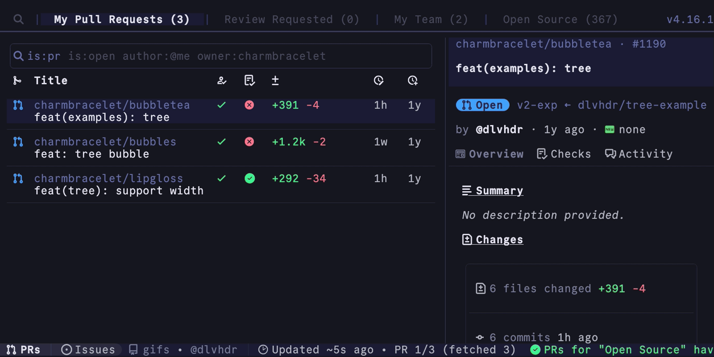

 

  <a  class="underline: none;" href="https://gh-dash.dev">
    <picture>
      <source media="(prefers-color-scheme: dark)" srcset="./docs/public/logo.png">
      
    </picture>
  </a>

    <a href="https://gh-dash.dev" target="_blank">→ https://gh-dash.dev ←</a>

  A rich terminal UI for GitHub that doesn't break your flow.
   
   
  
  
  
  

 

## 🌟 Features

- User-defined, per-repo, PRs & issues sections
- Overridable vim-style keyboard hotkeys
- Custom actions to perform your specific workflow needs
- Everything you can do on GitHub - diff, comment, checkout, push, update etc.
- Control every setting with a YAML config file

If you like quickly navigating with your keyboard, seeing the PRs and issues you need and you <strong>love the terminal</strong> - <code>DASH</code> is for you! 🫵🏽

## 📃 Docs

`DASH` has an extensive docs site at [gh-dash.dev/getting-started](https://gh-dash.dev/getting-started).

## 👥 Discord

Have questions? Join our [Discord community](https://discord.gg/SXNXp9NctV)!

## ❤️ Sponsoring

If you enjoy `DASH` and want to help, consider supporting the project with a
donation at the [sponsors page](https://github.com/sponsors/dlvhdr).

Thank you to all past and existing sponsors! 🙏🏽

<!-- sponsors:begin -->
<!-- this list is auto-generated by https://github.com/goreleaser/sponsors -->

## Sponsors

<h3 align="center">TUI Visionary</h3>

&nbsp;&nbsp;
&nbsp;&nbsp;
&nbsp;&nbsp;

<h3 align="center">TUI Power User</h3>

&nbsp;&nbsp;
&nbsp;&nbsp;
&nbsp;&nbsp;
&nbsp;&nbsp;
&nbsp;&nbsp;
&nbsp;&nbsp;
&nbsp;&nbsp;
&nbsp;&nbsp;
&nbsp;&nbsp;
&nbsp;&nbsp;
&nbsp;&nbsp;
&nbsp;&nbsp;
&nbsp;&nbsp;
&nbsp;&nbsp;
&nbsp;&nbsp;
&nbsp;&nbsp;
&nbsp;&nbsp;
&nbsp;&nbsp;
&nbsp;&nbsp;
&nbsp;&nbsp;

<h3 align="center">TUI Backer</h3>

&nbsp;&nbsp;
&nbsp;&nbsp;
&nbsp;&nbsp;

<!-- sponsors:end -->

## 🙏 Contributing

See the contribution guide at [https://www.gh-dash.dev/contributing](https://www.gh-dash.dev/contributing/).

## 🛞 Under the hood

`DASH` uses:

- [bubbletea](https://github.com/charmbracelet/bubbletea) for the TUI
- [lipgloss](https://github.com/charmbracelet/lipgloss) for the styling
- [glamour](https://github.com/charmbracelet/glamour) for rendering markdown
- [vhs](https://github.com/charmbracelet/vhs) for generating the GIF
- [cobra](https://github.com/spf13/cobra) for the CLI
- [gh](https://github.com/cli/cli) for the GitHub functionality
- [delta](https://github.com/dandavison/delta) for viewing PR diffs

## Authors

Dolev Hadar ([@dlvhdr](https://github.com/dlvhdr)) and the [community](https://github.com/dlvhdr/gh-dash/graphs/contributors).
