# UML Diagrams

This document contains UML diagrams showing the structure, relationships, and interactions in gh-dash using Mermaid syntax.

## Table of Contents
1. [Class Diagrams](#class-diagrams)
2. [Sequence Diagrams](#sequence-diagrams)
3. [State Diagrams](#state-diagrams)
4. [Component Diagrams](#component-diagrams)
5. [Activity Diagrams](#activity-diagrams)

---

## Class Diagrams

### 1. Core Model Structure

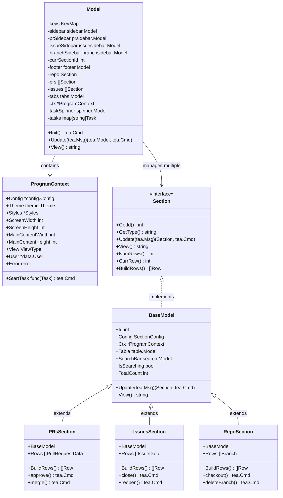

### 2. Configuration System

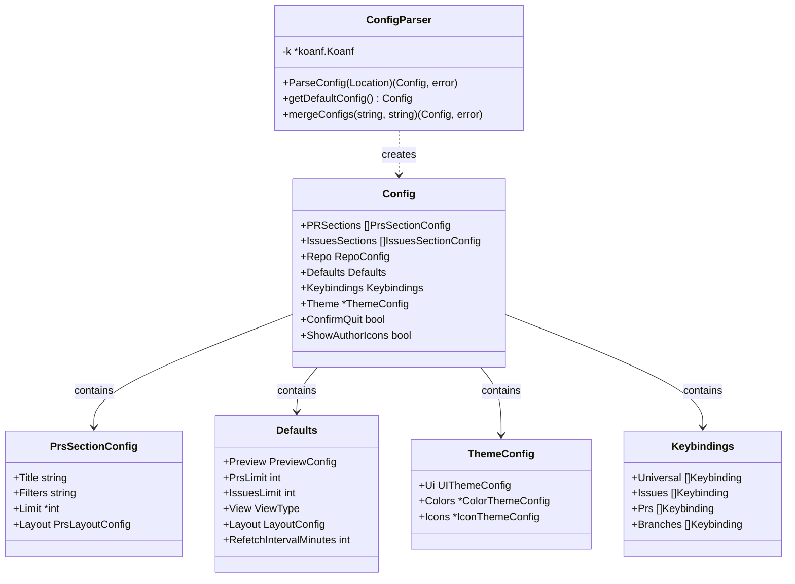

### 3. Data Layer

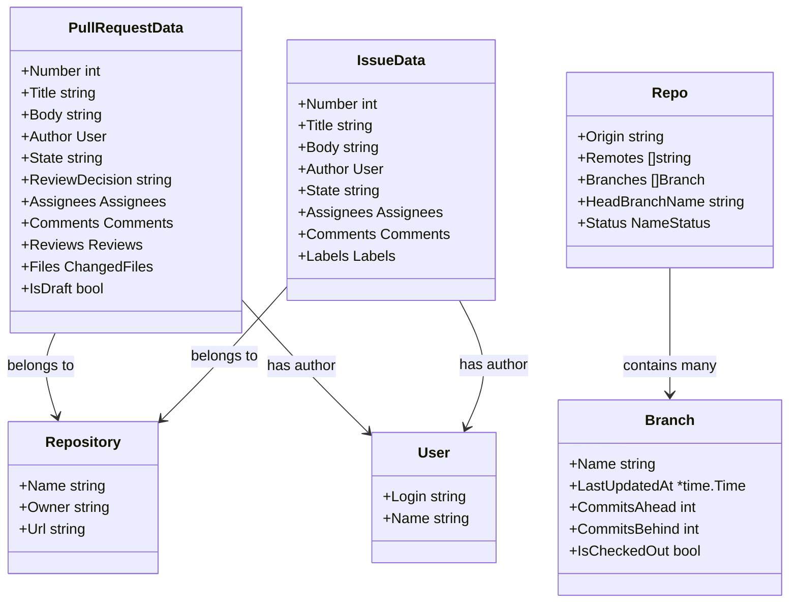

### 4. Component Hierarchy

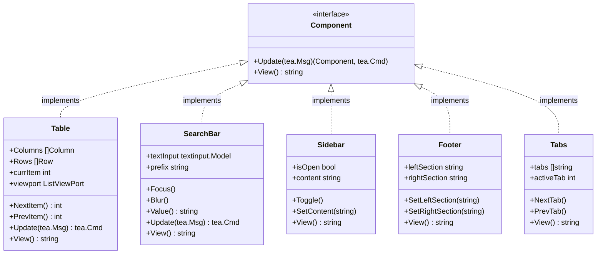

---

## Sequence Diagrams

### 1. Application Startup

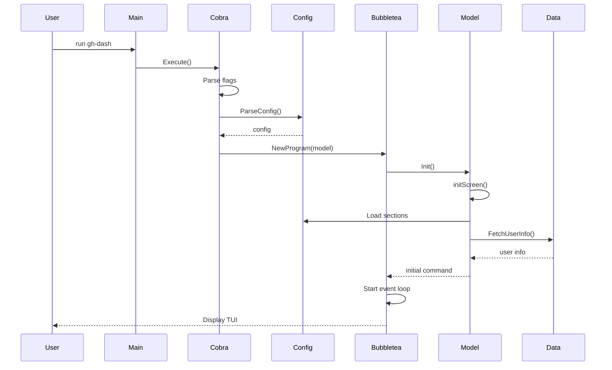

### 2. User Presses Key

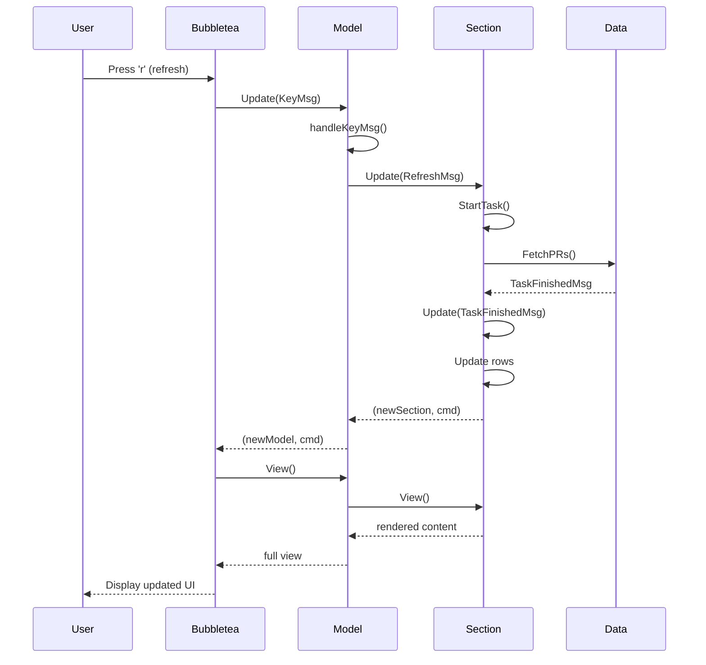

### 3. Data Fetching Flow

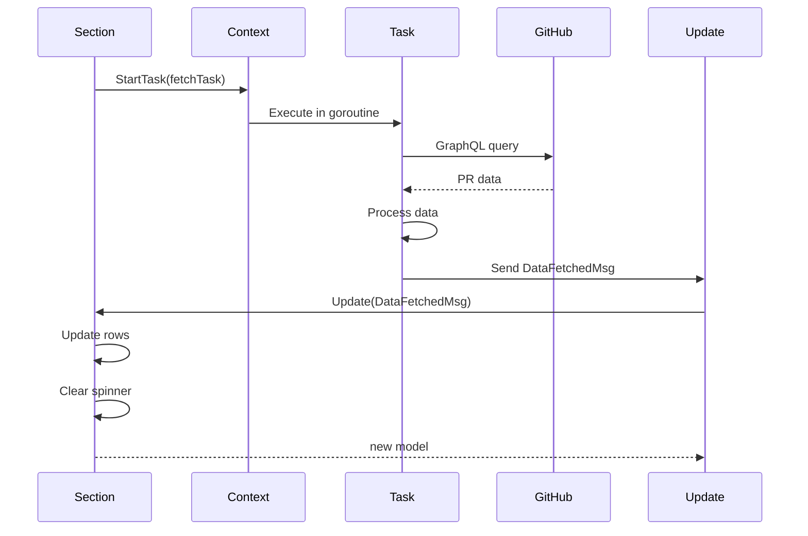

### 4. Window Resize

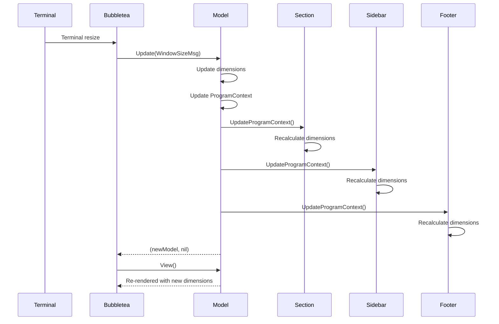

### 5. PR Approval Flow

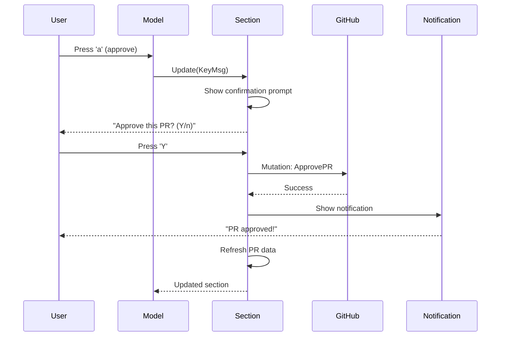

---

## State Diagrams

### 1. Section State Machine

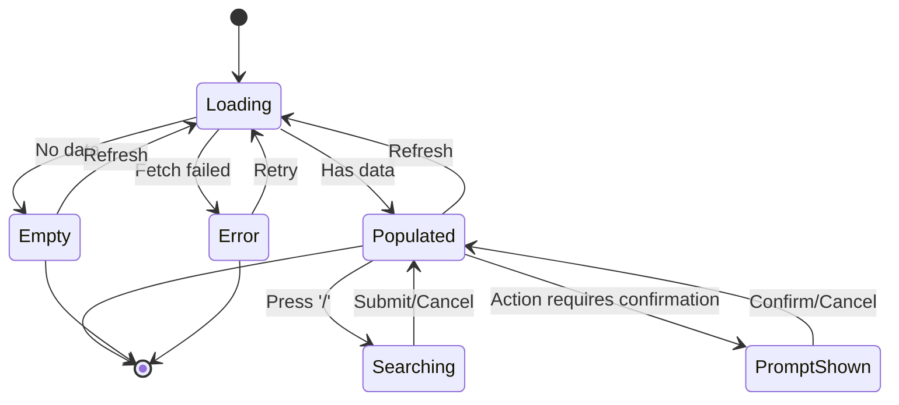

### 2. Sidebar State Machine

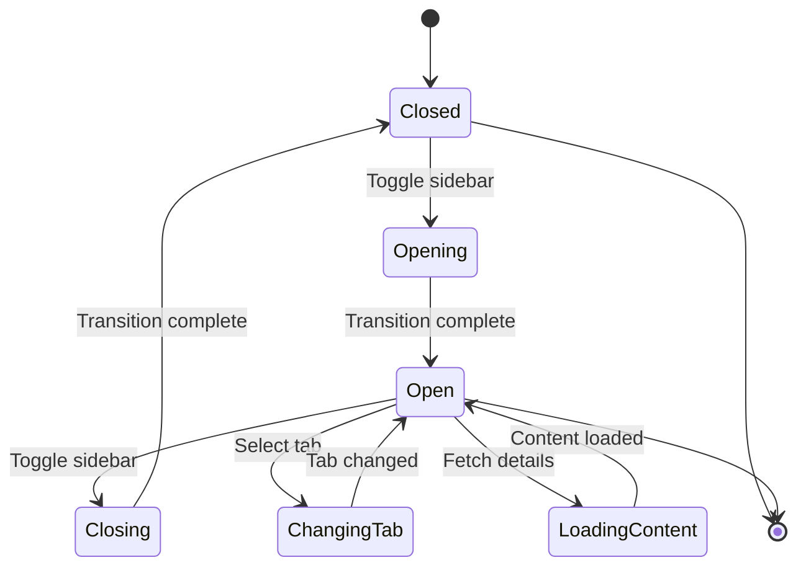

### 3. Task Execution State

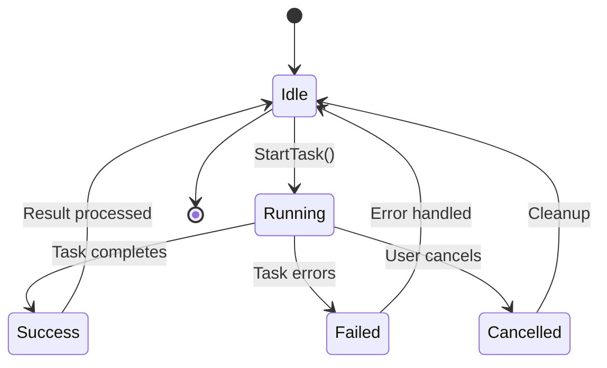

---

## Component Diagrams

### 1. High-Level Architecture

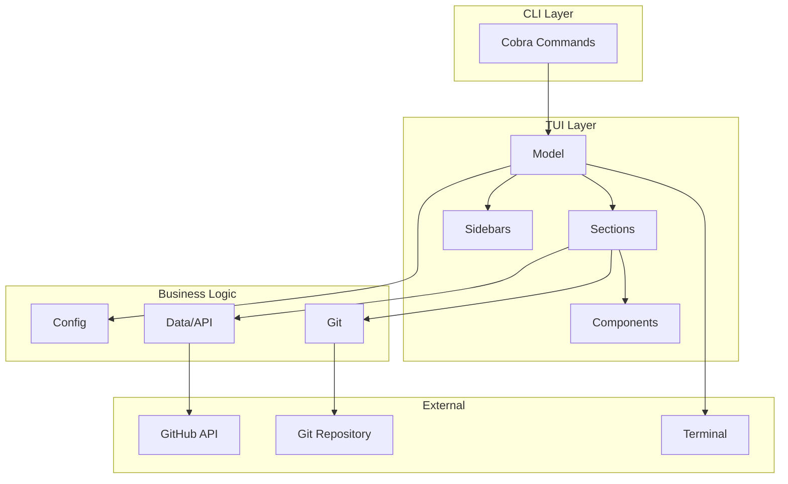

### 2. Data Flow Architecture

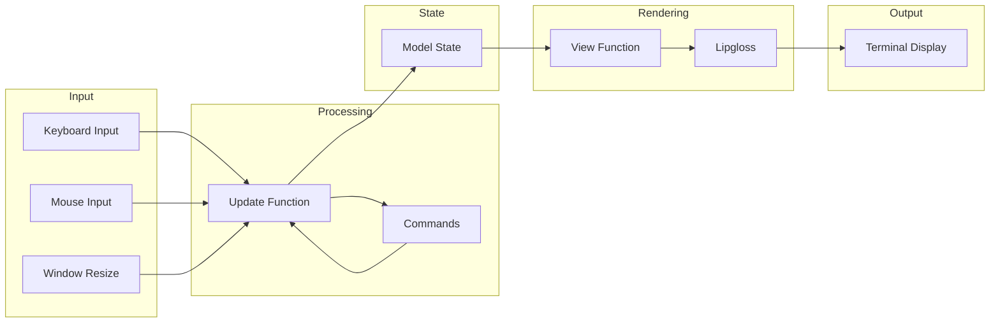

---

## Activity Diagrams

### 1. PR Merge Flow

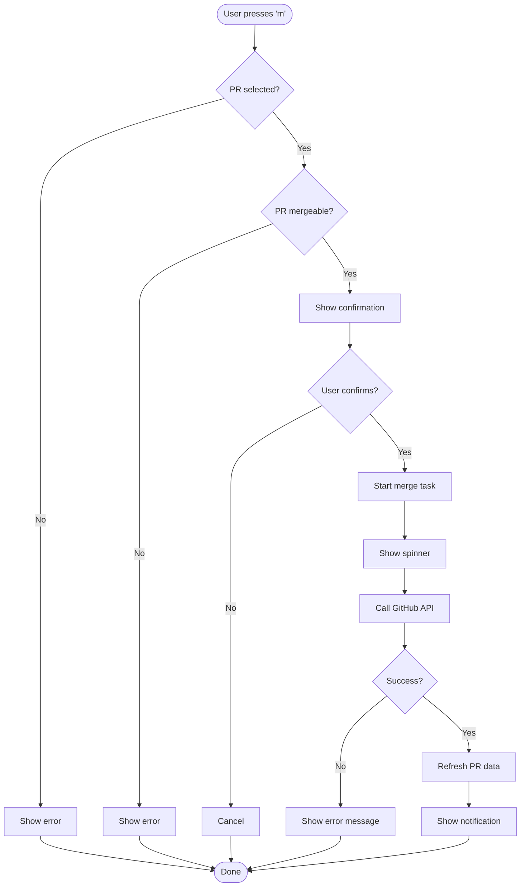

### 2. Configuration Loading

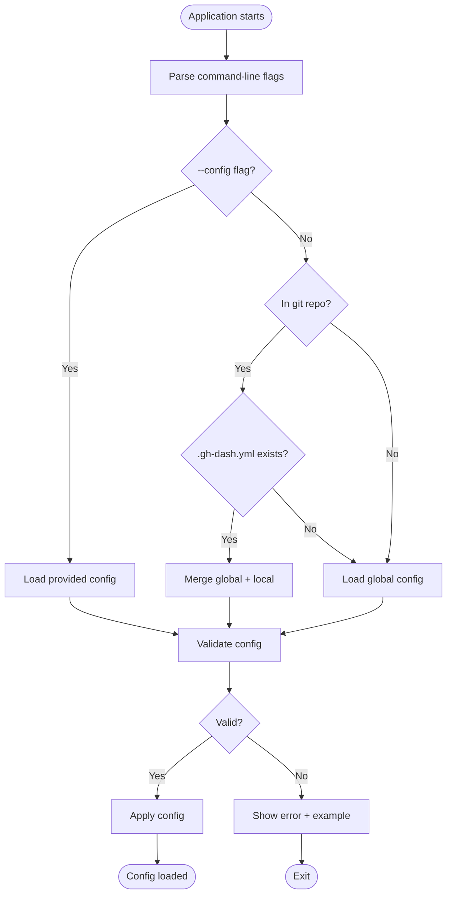

### 3. Search/Filter Flow

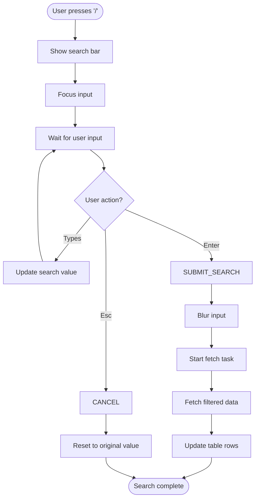

---

## Summary

These diagrams illustrate:

1. **Class Diagrams**: Structure and relationships between classes
2. **Sequence Diagrams**: Interaction flows over time
3. **State Diagrams**: State transitions of components
4. **Component Diagrams**: High-level architecture
5. **Activity Diagrams**: Workflow processes

Key patterns visible:
- **Elm Architecture**: Update → Model → View cycle
- **Message Passing**: Components communicate via messages
- **Async Tasks**: Background operations with callbacks
- **Layered Architecture**: CLI → TUI → Business Logic → External

Use these diagrams to:
- Understand system structure
- Plan new features
- Debug issues
- Onboard new developers
- Document architecture decisions
