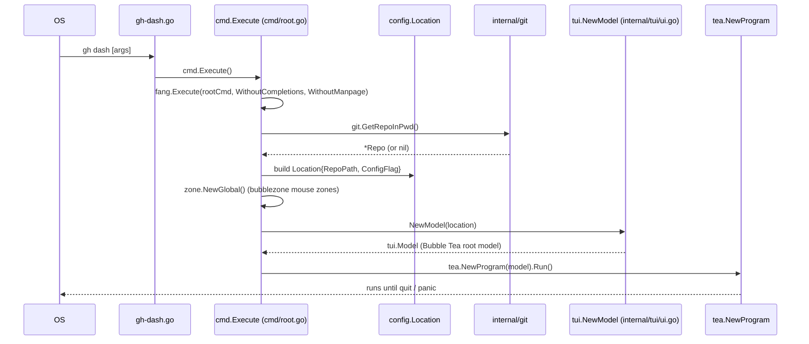
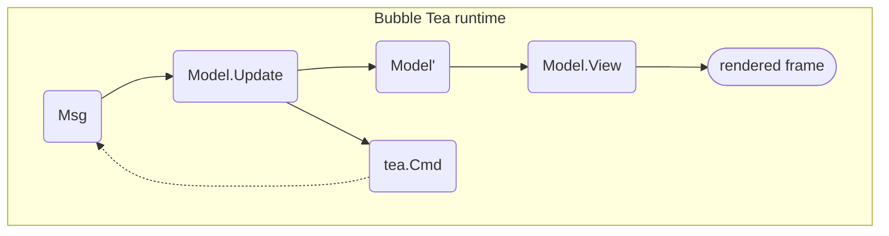
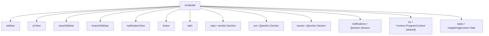
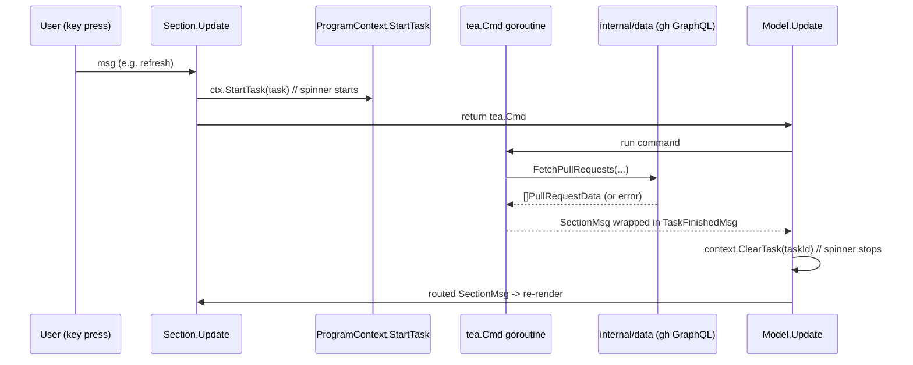

# Architecture

How `gh-dash` is wired together — from process entry to pixels on screen. Use this as a reference when debugging, adding a section, or tracing how a user key-press becomes a GitHub API call.

> For a task-focused walkthrough (how to add things), see [development.md](./development.md). For the package map, see [project-structure.md](./project-structure.md).

## Startup flow



Key points:
- **Entry point** is the one-line [`gh-dash.go`](../gh-dash.go) → [`cmd.Execute()`](../cmd/root.go#L68) wrapped by [`fang`](https://github.com/charmbracelet/fang) (Charm's Cobra polish) with completions and manpage disabled.
- **Version info** (`Version`, `Commit`, `Date`, `BuiltBy`) is injected at link time by GoReleaser via `-X` ldflags — see [build-and-deployment.md](./build-and-deployment.md#release-pipeline).
- **Flags** on `rootCmd`: `--config/-c`, `--debug`, `--cpuprofile`. The debug flag swaps `log.SetOutput` to `debug.log`.
- **Repo detection** happens *before* model construction so the repo-local `.gh-dash.yml` can be found later by the config parser.
- **Config loading is deferred.** `NewModel` only stores the `Location`; actual YAML parsing happens inside `initScreen` via `tea.Batch(tea.RequestBackgroundColor, m.initScreen)` once the Bubble Tea runtime starts.

## The Bubble Tea loop

`gh-dash` follows the standard Elm architecture: every frame is `View(Update(Msg, Model))`.



### Root model composition

The root [`Model`](../internal/tui/ui.go#L48) owns every visible component plus shared state:



The `ctx *context.ProgramContext` pointer is shared by reference with every sub-component — it carries screen dimensions, current view, config, theme, styles, and a `StartTask` callback. **Mutate it carefully: there is no deep copy.**

### Update merges many `tea.Cmd`s

Sub-components return `tea.Cmd`s from their own `Update` calls; the root `Model.Update` in [`internal/tui/ui.go`](../internal/tui/ui.go) merges them via `tea.Batch(...)`. Never block the Update loop with synchronous I/O — always return a `tea.Cmd`.

## Sections — the main extension point

A **section** is one configurable pane (e.g. "My open PRs", "Assigned issues"). Sections are defined in the user's YAML and backed by a Go package that implements the [`Section`](../internal/tui/components/section/section.go#L143) interface.

```go
type Section interface {
    Identifier          // GetId(), GetType()
    Component           // Update(msg) (Section, tea.Cmd), View() string
    Table               // NumRows, GetCurrRow, paging, BuildRows, ResetRows, IsLoading
    Search              // SetIsSearching, IsSearchFocused, ResetFilters, GetFilters
    PromptConfirmation  // confirmation-dialog plumbing
    GetConfig() config.SectionConfig
    UpdateProgramContext(ctx *context.ProgramContext)
    MakeSectionCmd(cmd tea.Cmd) tea.Cmd
    GetPagerContent() string
    GetItemSingularForm() string
    GetItemPluralForm() string
    GetTotalCount() int
}
```

### Current implementations

| Package | Purpose |
| --- | --- |
| [`components/prssection/`](../internal/tui/components/prssection/) | Pull request list |
| [`components/issuessection/`](../internal/tui/components/issuessection/) | Issue list |
| [`components/notificationssection/`](../internal/tui/components/notificationssection/) | Notifications inbox |
| [`components/reposection/`](../internal/tui/components/reposection/) | Repo-scoped view (gated by `FF_REPO_VIEW`) |

Each concrete section embeds [`section.BaseModel`](../internal/tui/components/section/section.go#L30), which supplies pagination, a `search.Model`, a `prompt.Model`, and a `table.Model`. Concrete packages own a typed row slice (e.g. `[]prrow.Data`) that wraps the raw GraphQL struct.

> **Adding a new section family** means stubbing every interface method above *and* extending the root `Model` in `internal/tui/ui.go` with a new slice — the root holds separate `prs`, `issues`, `notifications` slices plus a single `repo` section. See [development.md](./development.md#how-to-add-a-new-section).

## Data layer

All GitHub data flows through [`internal/data/`](../internal/data/) using the `gh` CLI's authenticated transport plus [`shurcooL/githubv4`](https://github.com/shurcooL/githubv4) for GraphQL typing.

Three primary fetchers:

| Function | Returns |
| --- | --- |
| `FetchPullRequests` | `[]PullRequestData` |
| `FetchIssues` | `[]IssueData` |
| `FetchNotifications` | `[]NotificationData` |

Raw GraphQL structs are wrapped into display types (e.g. `prrow.Data` wraps `*data.PullRequestData`) before rendering. That wrapper layer is where UI-only fields (computed status, color keys, fetch timestamp) live.

### Async fetch pattern

Blocking the `Update` loop on I/O would freeze the TUI. Instead, sections register a background task and return a `tea.Cmd`:



Key files:
- `context.Task` + `StartTask` / `ClearTask`: [`internal/tui/context/`](../internal/tui/context/)
- `TaskFinishedMsg` wrapper: [`internal/tui/constants/`](../internal/tui/constants/)
- `SectionMsg` envelope: [`section.BaseModel.MakeSectionCmd`](../internal/tui/components/section/section.go#L400)

## Config layer

Parsing is handled by [`internal/config/parser.go`](../internal/config/parser.go) using [koanf](https://github.com/knadh/koanf) with the YAML parser and `go-playground/validator` for validation.

**Load order** (first match wins for the config path):

1. `--config <path>` CLI flag
2. `GH_DASH_CONFIG` environment variable
3. Repo-local `.gh-dash.yml` (resolved via `git.GetRepoInPwd()` in `cmd/root.go`)
4. Global `XDG_CONFIG_HOME/gh-dash/config.yml` (falls back to `$HOME/.config/gh-dash/config.yml` if XDG is unset). If missing, it is **created** with a default skeleton.

After loading, keybindings are rebound globally via `keys.Rebind(...)` so the user's overrides apply everywhere.

### Feature flags

Runtime-toggled via env vars, read through `config.IsFeatureEnabled`:

| Flag constant | Env var | Effect |
| --- | --- | --- |
| `FF_REPO_VIEW` | `FF_REPO_VIEW` | Enables the repo-scoped view and accepts a positional repo arg. |
| `FF_MOCK_DATA` | `FF_MOCK_DATA` | Replaces real fetches with canned fixtures (useful for UI work). |

## Theming

Themes live in [`internal/tui/theme/theme.go`](../internal/tui/theme/theme.go). Colors use Lip Gloss v2's `compat.AdaptiveColor` so a single style renders correctly in both light and dark terminals. The default palette is assigned at model construction (`Theme: *theme.DefaultTheme`) and every component reaches for styles through `ctx.Styles.*` instead of importing the theme package directly.

## Non-obvious patterns to know

- **Async-only I/O.** Everything that touches the network or shells out must return a `tea.Cmd`. Synchronous work inside `Update` freezes the TUI.
- **Shared mutable `ProgramContext`.** Passed by pointer everywhere; treat it as append-only from component code and expect concurrent reads during `Update`.
- **Task spinner.** Register with `ctx.StartTask(task)` before dispatching a fetch; the root clears it when `TaskFinishedMsg` arrives. Forgetting to clear = stuck spinner.
- **Dynamic preview layout.** `ctx.PreviewPosition` and `ctx.DynamicPreviewWidth|Height` are computed per-frame from terminal size. **Don't hardcode dimensions** in components; read these instead.
- **Mouse zones.** `zone.NewGlobal()` in `cmd/root.go` initializes [bubblezone](https://github.com/lrstanley/bubblezone) v2 for click/hover zones across components.
- **Custom commands shell out.** User-defined commands in YAML are rendered via `text/template` (with `sprout` funcs) and executed via `exec.Command`. `RepoPath` resolution is a known sharp edge — check commit history around custom-command templating before changing it.

## Further reading

- [project-structure.md](./project-structure.md) — which package holds what.
- [build-and-deployment.md](./build-and-deployment.md) — how a tag becomes a release.
- [development.md](./development.md) — concrete "how do I add X?" recipes.
