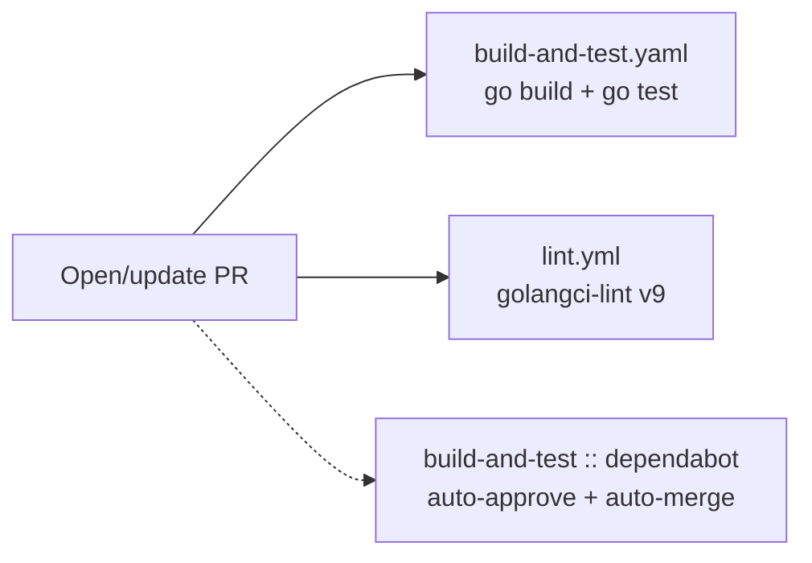
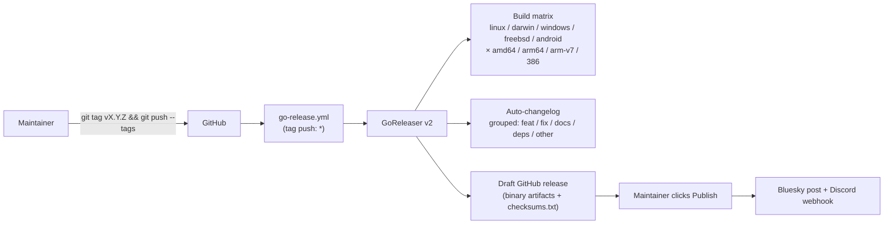

# Build & Deployment

Everything from "I want to run this on my laptop" to "a tag just hit `main`, what happens next?"

All `task` commands assume you are inside `devbox shell`. See [development.md](./development.md#dev-environment) for setup.

## Quick command reference

| Task | Command | What it does |
| --- | --- | --- |
| Run against your real config | `task` (alias for `task default`) | `go run . {{.CLI_ARGS}}` |
| Build a local binary | `task build` | `go build .` (produces `./gh-dash`) |
| Install as `gh` extension (from local source) | `task install` | builds, removes any existing `gh dash`, installs local build, prints `gh dash --version` |
| Reinstall the released version | `task install:prod` | removes local build, reinstalls `dlvhdr/gh-dash` from upstream |
| Uninstall the extension | `task uninstall` | `gh ext remove dash` |
| Run all tests | `task test ./...` | wraps `prism test` |
| Run one test | `task test:one -- -run TestName ./path/to/pkg` | wraps `gotip` |
| Rerun last failing test | `task test:rerun` | `gotip --rerun` |
| Lint | `task lint` | `golangci-lint run --timeout=5m` |
| Auto-fix lint issues | `task lint:fix` | `golangci-lint run --fix` |
| Format Go files | `task fmt` | `gofumpt -w $(git ls-files '*.go')` |
| Debug run (writes `debug.log`) | `task debug` | `DEBUG=true go run . --debug` |
| Warn-only debug run | `task debug:warn` | same, `LOG_LEVEL=warn` |
| Tail debug logs | `task logs` | `tail -f ./debug.log` |
| Headless Delve debugger | `task dlv` | `dlv debug --headless --listen=127.0.0.1:43000` |
| Nerd Font validation | `task check-nerd-font` | scans `.go` files for broken icons |
| Fix broken Nerd Font icons | `task fix-nerd-font` | auto-fix via `nerdfix` |

Run `task --list` for the authoritative, always-up-to-date menu.

### Pre-push checklist

No git pre-commit hook is configured. Before pushing, run:

```sh
task fmt
task lint
task test ./...
```

CI enforces `task lint` and `go test ./...` — fixing locally saves a round-trip.

## Local testing

- `prism` (installed via devbox init hook) is the test runner wrapper used by `task test`.
- `gotip` (also installed via devbox init hook) is used by `task test:one` / `task test:rerun`.
- TUI tests use helpers under [`internal/tui/testutils/`](../internal/tui/testutils/) plus golden files. Fixture data lives in per-package `testdata/` directories (e.g. `internal/config/testdata/`).
- Toggle `FF_MOCK_DATA=1` to run the binary against canned data instead of the live GitHub API — useful when iterating on rendering.

## Debugging

- **Logging**: `task debug` in one pane, `task logs` in another.
  - Logger is Charm's `charm.land/log/v2`. Import and use `log.Debug("msg", "key", value)`.
  - `LOG_LEVEL` env var accepts `debug` (default for `task debug`), `info`, `warn`, `error`.
- **Delve**: `task dlv` starts Delve in headless mode on `127.0.0.1:43000`. Attach from Neovim / VS Code / JetBrains.
- **CPU profile**: `--cpuprofile=<file>` on the binary; analyse with `go tool pprof`.

## Continuous integration

Pull requests trigger three workflows, all under [`.github/workflows/`](../.github/workflows/):



- **`build-and-test.yaml`** — skips PRs that only touch `docs/**`. Uses `go-version-file: ./go.mod`, so the CI Go toolchain matches the module's declared version (currently 1.25.x) rather than the devbox-pinned 1.23. Dependabot PRs are auto-approved and auto-merged (`--squash --auto`) once build+test pass.
- **`lint.yml`** — runs on every PR; does not skip paths. Uses `stable` Go and `golangci-lint-action@v9` with the repo's [`.golangci.yml`](../.golangci.yml).
- **`dependabot-sync.yml`** — keeps dependabot PRs rebased on `main`.

## Release pipeline

Releases are **tag-driven**. GoReleaser runs on any tag push and builds a full platform matrix from [`.goreleaser.yaml`](../.goreleaser.yaml).



### What the release workflow does

[`.github/workflows/go-release.yml`](../.github/workflows/go-release.yml) is ~35 lines:

1. Checkout with `fetch-depth: 0` (needed by GoReleaser for the changelog).
2. Set up Go (`>=1.21.0`, with module cache).
3. Run `goreleaser release --clean --draft` under GoReleaser v2.
4. Injects three secrets into the env: `DISCORD_WEBHOOK_ID`, `DISCORD_WEBHOOK_TOKEN`, `BLUESKY_APP_PASSWORD`. Plus `GITHUB_TOKEN` from the workflow's default permissions (`contents: write`).

> **`--draft` is significant.** The workflow creates a **draft** GitHub release. You still need to open the release in the GitHub UI and click **Publish** for it to go live and for the Bluesky / Discord announcements to fire. Do not assume `git push --tags` is the whole release.

### Build matrix

| OS | amd64 | arm64 | arm (v7) | 386 |
| --- | :-: | :-: | :-: | :-: |
| linux | ✓ | ✓ | ✓ | ✓ |
| darwin | ✓ | ✓ | ✓ | ✓ |
| windows | ✓ | ✓ | — | ✓ |
| freebsd | ✓ | ✓ | ✓ | ✓ |
| android | — | ✓ | — | — |

Build configuration ([`.goreleaser.yaml`](../.goreleaser.yaml)):
- `CGO_ENABLED=0` — pure-Go static binaries.
- Build tag `nodbus` — disables dbus / systemd notification code paths for portable, CGO-free builds.
- ldflags inject four version vars into `cmd/`:
  - `-X .../cmd.Version={{.Version}}`
  - `-X .../cmd.Commit={{.Commit}}`
  - `-X .../cmd.Date={{.CommitDate}}`
  - `-X .../cmd.BuiltBy=goreleaser`
- Binary-only archives named `gh-dash_{{tag}}_{{os}}-{{arch}}[_v7]`.
- `checksums.txt` generated alongside.

### Changelog grouping

`.goreleaser.yaml` groups commits in the release notes by message prefix — this is **why the repo uses Conventional Commits**:

| Group | Regex (from `.goreleaser.yaml`) |
| --- | --- |
| New Features | `^.*feat[(\w)]*:+.*$` |
| Bug fixes | `^.*fix[(\w)]*:+.*$` |
| Documentation updates | `^.*docs[(\w)]*:+.*$` |
| Dependency updates | `^.*(deps)*:+.*$` |
| Other work | everything else (order: 9999) |

Commits matching `^test:`, `^chore`, `Merge pull request`, `go mod tidy`, etc. are excluded entirely.

## What this pipeline does **not** do

- **No Homebrew tap publishing.** Users install via `gh extension install dlvhdr/gh-dash`.
- **No binary signing / notarization.** macOS users may need to right-click → Open on first launch.
- **No Docker image push** (the old docs-site Docker workflow was removed along with the Astro site).
- **No automatic tag bumping.** Maintainers create and push tags manually.

## Cutting a release (maintainer quick-start)

```sh
# 1. Ensure main is green
gh run list --branch main --limit 5

# 2. Tag and push (annotated tag recommended)
git tag -a v4.x.y -m "v4.x.y"
git push origin v4.x.y

# 3. Watch GoReleaser
gh run watch -R dlvhdr/gh-dash

# 4. Open the draft release, review the auto-generated changelog, fill in
#    the "what's new" blurb at the top, then click Publish.
#    Announcements (Bluesky + Discord) fire on publish.
```
